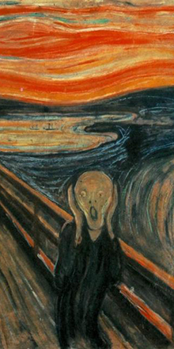

# My Machine Learning Repository
* Store my Machine Learning code here
* Currently a Whole Bunch of practice problems

# Style Transfer Sample - Self Portrait
* Here is an example of a "practical"/artistic application of machine learning

     

 

 

* My own fork of the code is [here](https://github.com/joexu22/fast-style-transfer)
* The code I credit to [Fast Style Transfer](https://github.com/lengstrom/fast-style-transfer)

# Other Samples

 

 

 

* I didn't end up making lots of these as it takes half-a-day/all-night to generate the "checkpoints"

# Holy Cow - It's Alive
* Frankansteined my workflow, but I can now code from the comfort of my main Windows 10 workstation
* Installing tensorflow on Windows was not "fun"
* <Having my Photoshop/DAW tools> a couple clicks might be worth it though

# Instructions - For Windows 10 (Cause I'm Too Crazy/Lazy To Just Dual Boot Ubuntu On My Main PC)
* **Linux Subsystem on Windows 10 does not currently allow NVIDIA GPU use**
* The Current Method is subject to depreciation I'll probably upgrade at some point
* From Nvidia:
  - Install Cuda Toolkit 9.0
  - Install CUDNN 7
  - Copy Files From CUDNN over to C:\Program Files\NVIDIA GUP Computing Toolkit\Cuda\v9.0

* From Google:
  - [Attempt To Build tensorflow From Source...]
  - [Or] Aquire tensorflow-gpu.whl from https://pypi.python.org/pypi/tensorflow-gpu

* From Anaconda/Python:
  - Download and Install Anaconda https://www.anaconda.com/download/
  - Set up Anaconda virtual env
  - Build tensorflow in Anaconda virtual env

* Configure Visual Studio execute from virtual env folder
  - Create Custom Environment with currect locations
  - <path_to_anaconda>\Anaconda3\env\<env_name>
  - Set Custom Environment to default for VS

* Sacrifice A Young Animal
* Pray to Cthulhu

* Start some Machine Learning excercises on Windows 10

# Credits
* Lots of the sample Machine Learning code I is from TensorFlow website
* The sample images where generated with code from [Fast Style Transfer](https://github.com/lengstrom/fast-style-transfer)